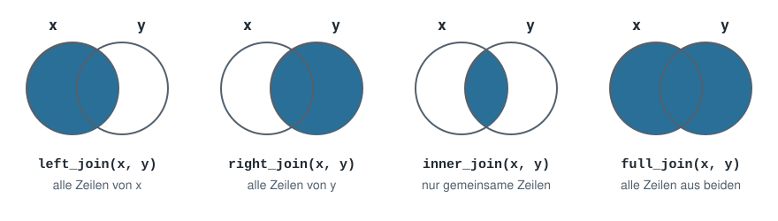
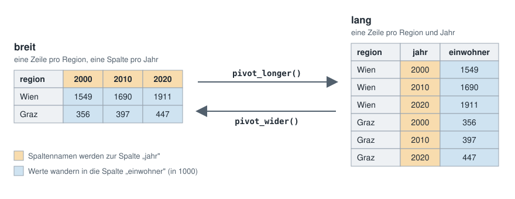

```{r setup, include=FALSE}
knitr::opts_chunk$set(echo = TRUE, message = FALSE)
options(width = 110)   # breite Tabellen nicht umbrechen
```

In Einheit 3 hast du Daten eingelesen und aufgeräumt. Jetzt geht es darum, sie auszuwerten
und darzustellen:

1. **Datenbearbeitung mit `dplyr`** — filtern, sortieren, neue Spalten berechnen, gruppieren, verbinden, umformen
2. **Visualisierung mit `ggplot2`** — Grafiken schichtweise aufbauen

Dafür werden drei Pakete gebraucht. Falls noch nicht geschehen, einmalig **in der Console**
installieren: `install.packages(c("dplyr", "tidyr", "ggplot2"))`. Geladen werden Pakete immer
**am Anfang** des Dokuments — so sieht man sofort, was es braucht:

```{r}
library(dplyr)     # Daten bearbeiten
library(tidyr)     # Tabellen umformen
library(ggplot2)   # Grafiken
```

Wir arbeiten mit den Gemeinde-Daten, die du in Einheit 3 schon eingelesen hast: 28
österreichische Gemeinden mit Bundesland, Gemeindetyp, Einwohnerzahl, Fläche, Entfernung zur
Landeshauptstadt (Luftlinie in km) und durchschnittlichem Preis für Baugrundstücke (in € pro
m²; Quelle: Statistik Austria):

```{r}
gemeinden     <- read.csv("data/raw/gemeinden.csv")
bundeslaender <- read.csv("data/raw/bundeslaender.csv")
```

Bei Ischgl fehlt der Preis (`NA`) — darauf kommen wir mehrmals zurück.


# Teil 1: Datenbearbeitung mit dplyr

`dplyr` bündelt die typischen Arbeitsschritte in wenige, gut lesbare Funktionen („Verben").
Jedes Verb bekommt einen Data Frame und gibt einen neuen Data Frame zurück.

## filter() — Zeilen auswählen

```{r}
filter(gemeinden, preis_m2 > 400)
filter(gemeinden, typ %in% c("Stadt", "Umland"), entfernung_km <= 20)
```

Zeilen, bei denen die Bedingung `NA` ergibt (hier: Ischgl), fallen bei `filter()` weg.

## select() — Spalten auswählen

```{r}
select(gemeinden, gemeinde, bundesland, einwohner)
```

## arrange() — sortieren

`arrange()` sortiert nach einer oder mehreren Spalten; `desc()` dreht die Reihenfolge um:

```{r}
arrange(gemeinden, desc(preis_m2))
```

## Der Pipe-Operator: %>% und |>

### Das Problem: mehrere Schritte hintereinander

Sollen mehrere Funktionen nacheinander angewendet werden, gibt es ohne Pipe zwei Wege — beide
sind unhandlich:

```{r}
# 1. Verschachteln: muss von innen nach außen gelesen werden
arrange(filter(gemeinden, bundesland == "Tirol"), desc(preis_m2))

# 2. Zwischenergebnisse speichern: lesbar, aber viele Hilfsvariablen
nur_tirol <- filter(gemeinden, bundesland == "Tirol")
arrange(nur_tirol, desc(preis_m2))
```

### Die Lösung: die Pipe

Der **Pipe-Operator** nimmt das Ergebnis auf seiner linken Seite und setzt es als **erstes
Argument** in die Funktion auf der rechten Seite ein.

Damit wird aus der Verschachtelung eine Kette, die man von oben nach unten liest. Die Pipe
spricht man am besten als **„und dann"**: *Nimm `gemeinden`, und dann filtere nach Tirol, und
dann sortiere nach dem Preis.*

```{r}
gemeinden %>%
  filter(bundesland == "Tirol") %>%
  arrange(desc(preis_m2))
```

Beachte den Unterschied zu vorher: Ohne Pipe steht der Data Frame als erstes Argument in der
Klammer, `filter(gemeinden, bundesland == "Tirol")`. Mit Pipe lässt man ihn weg,
`filter(bundesland == "Tirol")` — die Pipe setzt ihn automatisch ein.

### Zwei Schreibweisen: %>% und |>

In R gibt es nicht nur eine Pipe, sondern zwei: `%>%` und `|>`. Du wirst beiden begegnen.
Für alles, was in dieser Einführung vorkommt, verhalten sie sich **gleich** — hier dieselbe
Kette mit `|>`:

```{r}
gemeinden |>
  filter(bundesland == "Tirol") |>
  arrange(desc(preis_m2))
```

| | `%>%` | <code>&#124;&gt;</code> |
|---|---|---|
| Name | magrittr-Pipe | native Pipe (eingebaut) |
| Herkunft | Paket `magrittr`, wird von `dplyr` mitgeladen | fester Bestandteil von R seit Version 4.1 (2021) |
| braucht ein Paket? | ja — ohne `library(dplyr)` gibt es einen Fehler | nein |
| auf der Tastatur | *Strg/Cmd + Shift + M* (Standard in RStudio) | dasselbe Kürzel, wenn unter *Tools → Global Options → Code* „Use native pipe operator" angehakt ist. Von Hand: <code>&#124;</code> mit *AltGr + <* (Windows) bzw. *Option + 7* (Mac), dann `>` |

`%>%` war viele Jahre lang die einzige Pipe und steht deshalb in den meisten Büchern,
Tutorials und auch in diesem Kurs; neuere Texte verwenden immer öfter `|>`. Beide sind richtig.
Wichtig ist, dass du **beide lesen kannst**.

### Zwei kleine Unterschiede

Für den Anfang selten wichtig, aber gut zu wissen, wenn Code aus dem Netz nicht funktioniert:

1. **Klammern:** Bei `|>` muss rechts immer ein Funktions*aufruf* mit Klammern stehen.
   `gemeinden %>% head` funktioniert, `gemeinden |> head` nicht — richtig ist
   `gemeinden |> head()`. Einfachste Regel: **immer Klammern schreiben.**
2. **Platzhalter:** Soll das Ergebnis *nicht* an die erste Stelle, markiert man die Stelle mit
   einem Platzhalter — bei `%>%` ein Punkt `.`, bei `|>` ein Unterstrich `_` (nur mit
   Argumentnamen). Beispiel: `lm()` berechnet eine Regression und erwartet die Daten erst im
   Argument `data`:

```{r}
gemeinden %>% lm(preis_m2 ~ entfernung_km, data = .)
gemeinden |>  lm(preis_m2 ~ entfernung_km, data = _)
```


## mutate() — neue Spalten berechnen

`mutate()` berechnet eine neue Spalte aus bestehenden — elementweise für jede Zeile. Hier die
Bevölkerungsdichte, wie in Einheit 1. Gleichwertig in Basis-R wäre
`gemeinden$dichte <- gemeinden$einwohner / gemeinden$flaeche_km2`.

```{r}
gemeinden <- gemeinden %>%
  mutate(dichte = round(einwohner / flaeche_km2))

head(gemeinden)
```

## case_when() — Werte nach Bedingungen einteilen

Soll eine neue Spalte je nach Bedingung verschiedene Werte bekommen, nimmt man `case_when()`
in `mutate()`. Jede Zeile hat die Form `bedingung ~ ergebnis`; die erste zutreffende
Bedingung gewinnt, `TRUE ~` fängt alles Übrige auf:

```{r}
gemeinden <- gemeinden %>%
  mutate(preisniveau = case_when(
    is.na(preis_m2) ~ NA,          # fehlende Werte zuerst abfangen
    preis_m2 > 400  ~ "hoch",
    preis_m2 > 100  ~ "mittel",
    TRUE            ~ "niedrig"
  ))

gemeinden %>% select(gemeinde, preis_m2, preisniveau) %>% head(8)
```

Ohne die erste Zeile würde Ischgl als `"niedrig"` eingestuft: Die Vergleiche ergeben dort
`NA`, und dann greift `TRUE ~`.

## Mehrere Schritte kombinieren

```{r}
gemeinden %>%
  filter(bundesland == "Tirol") %>%
  select(gemeinde, typ, preis_m2) %>%
  arrange(desc(preis_m2))
```

## count() — Häufigkeiten zählen

`count()` zählt, wie oft jeder Wert vorkommt — das `dplyr`-Gegenstück zu `table()`:

```{r}
gemeinden %>% count(bundesland)
```

## group_by() + summarise() — Kennzahlen pro Gruppe

Eine der häufigsten Aufgaben: eine Kennzahl je Gruppe — z. B. der durchschnittliche Preis pro
Bundesland.

```{r}
gemeinden %>%
  group_by(bundesland) %>%
  summarise(
    anzahl        = n(),
    preis_mean    = mean(preis_m2),
    einwohner_max = max(einwohner)
  )
```

Die Ausgabe beginnt mit `# A tibble` — mehr dazu im Kasten.

::: {.callout-note title="Was ist ein Tibble?"}
Ein **Tibble** ist eine modernere Variante des Data Frames. Viele Funktionen aus `dplyr`,
`tidyr` und `readxl` geben einen zurück. Du kannst damit arbeiten wie mit jedem Data Frame;
drei Dinge sind anders:

- **Die Anzeige:** Oben stehen Größe (`4 × 4`) und unter jedem Spaltennamen der Datentyp
  (`<chr>`, `<int>`, `<dbl>`). Gezeigt werden nur die ersten zehn Zeilen und so viele Spalten,
  wie Platz haben — alles sieht man mit `View()` oder `print(n = Inf)`.
- **Eine Spalte auswählen:** `tabelle[, "spalte"]` liefert bei einem Tibble wieder eine
  Tabelle, bei einem Data Frame einen Vektor. Mit `tabelle$spalte` bekommt man in beiden
  Fällen den Vektor.
- **Umwandeln:** `as.data.frame()` macht aus einem Tibble einen gewöhnlichen Data Frame,
  `as_tibble()` geht den umgekehrten Weg.
:::

Bei Tirol steht `NA`, weil der Preis von Ischgl fehlt (siehe Einheit 1, *Fehlende Werte: NA*).
Mit `na.rm = TRUE` wird der fehlende Wert ausgelassen:

```{r}
gemeinden %>%
  group_by(bundesland) %>%
  summarise(anzahl = n(), preis_mean = mean(preis_m2, na.rm = TRUE))
```

## Datensätze verbinden: Joins

`bundeslaender` enthält zu jedem Bundesland die Region (Ost-, Süd- oder Westösterreich). Mit
einem **Join** wird diese Information über die gemeinsame Spalte `bundesland` an `gemeinden`
angehängt.

Die Datensätze passen nicht perfekt zusammen — wie so oft in der Praxis (hier haben wir es für
den Kurs so eingerichtet):

- **Viktorsberg** liegt in Vorarlberg, das in `bundeslaender` fehlt.
- **Salzburg** steht in `bundeslaender`, hat aber keine Gemeinden im Datensatz.

Die vier Join-Varianten unterscheiden sich genau darin, was mit solchen Zeilen passiert:

| Funktion | Behält |
|---|---|
| `left_join(x, y)` | alle Zeilen von `x`; fehlt die Entsprechung in `y` → `NA` |
| `right_join(x, y)` | alle Zeilen von `y` |
| `inner_join(x, y)` | nur Zeilen, die in **beiden** vorkommen |
| `full_join(x, y)` | alle Zeilen aus **beiden** |



```{r}
nrow(left_join(gemeinden, bundeslaender, by = "bundesland"))    # alle 28 Gemeinden, Viktorsberg mit Region NA
nrow(inner_join(gemeinden, bundeslaender, by = "bundesland"))   # 27 — Viktorsberg fällt weg
nrow(full_join(gemeinden, bundeslaender, by = "bundesland"))    # 29 — alle Gemeinden + Salzburg
```

Meist will man keine Zeilen verlieren, deshalb ist `left_join()` der Standard:

```{r}
gemeinden_join <- gemeinden %>%
  left_join(bundeslaender, by = "bundesland")

gemeinden_join %>% filter(is.na(region))
```

Über mehrere Spalten verbindet man mit `by = c("spalte1", "spalte2")`. In Basis-R heißt die
Funktion `merge()` (`merge(x, y, by = "bundesland", all.x = TRUE)` entspricht `left_join`).

## Breite und lange Tabellen: pivot_longer() und pivot_wider()

Dieselben Daten lassen sich auf zwei Arten anordnen. Ein kleines Beispiel: die Einwohnerzahl
von Wien und Graz in drei Jahren — sechs Zahlen, einmal breit und einmal lang.



- **breit:** eine Zeile pro Region, **eine Spalte pro Jahr**. So liest man Tabellen gern, und
  so liefern sie viele Statistikämter. Das Jahr steckt hier aber im **Spaltennamen** — R kann
  nicht danach filtern oder gruppieren.
- **lang:** eine Zeile pro Region **und** Jahr; jede Zeile ist eine einzelne Beobachtung. Das
  Jahr ist eine eigene Spalte, mit der `filter()`, `group_by()` und `ggplot2` arbeiten können.

Faustregel: Stehen in den Spaltennamen **Werte** (Jahre, Monate, Kategorien) statt Namen von
Variablen, ist die Tabelle breit.

Zum Umformen gibt es das Paket `tidyr`. Als Beispiel dient ein Originalexport aus der
[ARDECO-Datenbank](https://urban.jrc.ec.europa.eu/ardeco) der Europäischen Kommission: die
Bevölkerung am 1. Jänner für 36 Staaten und ihre NUTS-3-Regionen — die Quelle, aus der auch
die Daten für Übungsaufgabe 1 stammen. Die Tabelle ist **breit**:

```{r}
bev_breit <- read.csv("data/raw/ardeco_bevoelkerung.csv")

dim(bev_breit)   # Zeilen und Spalten: 75 Spalten sind zu viele, um alle anzuzeigen

# die ersten drei Zeilen, nur die Namensspalten und die ersten drei Jahre
bev_breit[1:3, c("TERRITORY_ID", "NAME_HTML", "X1960", "X1961", "X1962")]
```

Jedes Jahr von 1960 bis 2027 ist eine eigene Spalte. Weil Spaltennamen in R nicht mit einer
Ziffer beginnen dürfen, hat `read.csv()` ein `X` davorgesetzt (`X1960`).

`pivot_longer()` macht aus vielen Spalten zwei: eine für die bisherigen Spalten**namen**
(`names_to`, im Bild orange) und eine für die **Werte** (`values_to`, im Bild blau). `cols`
legt fest, welche Spalten gemeint sind — hier alle, die mit `X` beginnen:

```{r}
bev_lang <- bev_breit %>%
  pivot_longer(cols = starts_with("X"), names_to = "jahr", values_to = "einwohner",
               names_prefix = "X") %>%          # das X vor der Jahreszahl entfernen
  mutate(jahr = as.integer(jahr)) %>%           # "1960" (Text) -> 1960 (Zahl)
  select(TERRITORY_ID, NAME_HTML, jahr, einwohner)

dim(bev_lang)    # jetzt viel mehr Zeilen, aber nur vier Spalten
head(bev_lang, 3)
```

Aus 1374 Zeilen mit 68 Jahresspalten sind 1374 · 68 = 93 432 Zeilen geworden. Jetzt lässt
sich nach dem Jahr filtern wie nach jeder anderen Spalte.

`pivot_wider()` geht den umgekehrten Weg: Die Werte einer Spalte (`names_from`, orange) werden
zu Spaltennamen, eine zweite Spalte (`values_from`, blau) füllt die Zellen — praktisch, um
Jahre nebeneinander zu stellen und zu vergleichen:

```{r}
bev_lang %>%
  filter(TERRITORY_ID %in% c("AT", "AT130"), jahr %in% c(1960, 1990, 2020)) %>%
  pivot_wider(names_from = jahr, values_from = einwohner, names_prefix = "einwohner_")
```

### Übung

1. Welche drei Gemeinden haben die meisten Einwohner? Zeige nur `gemeinde` und `einwohner`.
2. Zeige für die Tiroler Gemeinden `gemeinde`, `typ` und die Bevölkerungsdichte (Einwohner
   pro km², gerundet), sortiert von der dichtesten zur dünnsten.
3. Berechne pro `typ` die Anzahl Gemeinden und den durchschnittlichen Preis, absteigend
   sortiert nach dem Durchschnitt. Was fällt auf?
4. Verbinde `gemeinden` mit `bundeslaender` und berechne den durchschnittlichen Preis pro
   `region`. Für welche Gemeinde fehlt die Region — und warum?
5. Erstelle aus `bev_lang` eine breite Tabelle mit den Einwohnern von 1990 und 2024 für
   Österreich (`AT`), Deutschland (`DE`) und die Schweiz (`CH`). Um wie viel Prozent ist die
   Bevölkerung jeweils gewachsen?

```{r}
# dein Code

```


# Teil 2: Visualisierung mit ggplot2

## Die Daten vorbereiten

Wir verwenden `gemeinden_join` aus Teil 1 (Gemeinden mit Region). Bei Ischgl fehlt der Preis.
Ohne y-Wert kann `ggplot` keinen Punkt zeichnen und würde bei jeder Grafik warnen
(*„Removed 1 row containing missing values"*). Deshalb entfernen wir diese Zeile einmal vorab.

Außerdem machen wir `typ` zu einem Faktor mit sinnvoller Reihenfolge (siehe Einheit 2,
*Faktoren*) — sonst sortiert `ggplot` die Gemeindetypen alphabetisch:

```{r}
gemeinden_plot <- gemeinden_join %>%
  filter(!is.na(preis_m2)) %>%
  mutate(typ = factor(typ, levels = c("Stadt", "Umland", "Land")))
```

## Der Grundaufbau

`ggplot2` baut Grafiken **schichtweise** mit `+` auf. Der Grundaufbau ist immer gleich:

```
ggplot(daten, aes(x = ..., y = ...)) +   # Daten + welche Spalte auf welche Achse
  geom_...()                             # welche Form: Punkte, Balken, Linien …
```

## Streudiagramm: geom_point()

```{r}
ggplot(gemeinden_plot, aes(x = entfernung_km, y = preis_m2)) +
  geom_point(color = "steelblue", size = 2) +
  labs(title = "Baugrundstückspreis nach Entfernung zur Landeshauptstadt",
       x = "Entfernung (km, Luftlinie)", y = "Preis (€ pro m²)") +
  theme_minimal()
```

Die Punkte streuen stark: Teure Gemeinden gibt es nahe an der Landeshauptstadt, aber auch
70 km entfernt. Ein klarer Zusammenhang ist so noch nicht zu erkennen.

## Nach Gruppe einfärben

Eine weitere Spalte in `aes()` auf `color` legen — `ggplot` vergibt automatisch Farben und eine
Legende:

```{r}
ggplot(gemeinden_plot, aes(x = entfernung_km, y = preis_m2, color = bundesland)) +
  geom_point(size = 2) +
  labs(title = "Preis nach Entfernung, eingefärbt nach Bundesland",
       x = "Entfernung (km, Luftlinie)", y = "Preis (€ pro m²)", color = "Bundesland") +
  theme_minimal()
```

Jetzt wird das Muster sichtbar: In Tirol und Vorarlberg ist Bauland durchwegs viel teurer
als im Burgenland und in der Steiermark. Im Burgenland und in der Steiermark sinkt der Preis
mit der Entfernung zur Landeshauptstadt. In Tirol ist das Bild uneinheitlich: Kufstein ist
teuer, obwohl es fast 70 km von Innsbruck entfernt liegt.

`color = "steelblue"` **außerhalb** von `aes()` setzt eine feste Farbe; `color = bundesland`
**innerhalb** von `aes()` färbt nach den Werten einer Spalte.

## Balkendiagramm einer Kennzahl: geom_col()

`dplyr` und `ggplot2` greifen ineinander: erst die Kennzahl berechnen, dann direkt an
`ggplot()` weiterreichen. Gemeinden ohne Region (Viktorsberg) filtern wir vorher heraus. Die
Farbe dient hier nur der Optik — die Regionen stehen schon auf der x-Achse, deshalb blenden wir die
Legende mit `show.legend = FALSE` aus:

```{r}
gemeinden_plot %>%
  filter(!is.na(region)) %>%
  group_by(region) %>%
  summarise(preis_mean = mean(preis_m2)) %>%
  ggplot(aes(x = region, y = preis_mean, fill = region)) +
  geom_col(show.legend = FALSE) +
  labs(title = "Durchschnittlicher Baugrundstückspreis pro Region",
       x = "Region", y = "Ø Preis (€ pro m²)") +
  theme_minimal()
```

Die Balken stehen in alphabetischer Reihenfolge. `reorder(region, preis_mean)` sortiert sie
nach der Kennzahl. Bei vielen Balken oder langen Namen dreht `coord_flip()` die Grafik, sodass
die Beschriftung waagrecht steht:

```{r}
gemeinden_plot %>%
  filter(!is.na(region)) %>%
  group_by(region) %>%
  summarise(preis_mean = mean(preis_m2)) %>%
  ggplot(aes(x = reorder(region, preis_mean), y = preis_mean)) +
  geom_col(fill = "steelblue") +
  coord_flip() +
  labs(title = "Durchschnittlicher Baugrundstückspreis pro Region, sortiert",
       x = "Region", y = "Ø Preis (€ pro m²)") +
  theme_minimal()
```

## Zeitverläufe: geom_line()

Für eine Entwicklung über die Zeit verbindet `geom_line()` die Werte zu einer Linie. Dafür
braucht es das **lange** Format — das Jahr als eigene Spalte, wie in `bev_lang` aus Teil 1.
Die Werte nach 2024 sind Prognosen, deshalb lassen wir sie weg:

```{r}
bev_lang %>%
  filter(TERRITORY_ID == "AT", jahr <= 2024) %>%
  ggplot(aes(x = jahr, y = einwohner / 1000000)) +
  geom_line(color = "steelblue", linewidth = 1) +
  labs(title = "Bevölkerung Österreichs, 1960–2024",
       x = "Jahr", y = "Einwohner (in Millionen)") +
  theme_minimal()
```

Für mehrere Linien in einer Grafik legt man eine Spalte auf `color`, z. B.
`aes(x = jahr, y = einwohner, color = NAME_HTML)`.

## Verteilungen: geom_boxplot() und geom_histogram()

```{r}
ggplot(gemeinden_plot, aes(x = typ, y = preis_m2)) +
  geom_boxplot(fill = "lightgrey") +
  labs(title = "Baugrundstückspreis je Gemeindetyp", x = "Gemeindetyp", y = "Preis (€ pro m²)") +
  theme_minimal()
```

`geom_histogram()` zeigt die Verteilung einer einzelnen Zahlenspalte:

```{r}
ggplot(gemeinden_plot, aes(x = preis_m2)) +
  geom_histogram(bins = 8, fill = "steelblue", color = "white") +
  theme_minimal()
```

## Teilgrafiken: facet_wrap()

`facet_wrap(~spalte)` zerlegt eine Grafik in ein Raster — eine Teilgrafik pro Ausprägung:

```{r}
ggplot(gemeinden_plot, aes(x = entfernung_km, y = preis_m2)) +
  geom_point(color = "darkred") +
  facet_wrap(~bundesland) +
  labs(title = "Preis nach Entfernung, aufgeteilt nach Bundesland",
       x = "Entfernung (km, Luftlinie)", y = "Preis (€ pro m²)") +
  theme_bw()
```

Vorarlberg ist nur mit einer Gemeinde vertreten, deshalb steht dort ein einzelner Punkt.

## Grafik speichern: ggsave()

`ggsave()` speichert die zuletzt erzeugte Grafik:

```{r, eval=FALSE}
ggsave("output/preis_entfernung.png", width = 8, height = 5)
```

## Weitere Möglichkeiten entdecken

`ggplot2` kann viel mehr, als hier Platz hat. Zum Nachschlagen und Ausprobieren:

- [ggplot2-Referenz](https://ggplot2.tidyverse.org/reference/) — alle `geom_...()`, Skalen
  und Themes mit Beispielen
- [ggplot2-Cheatsheet](https://rstudio.github.io/cheatsheets/html/data-visualization.html) —
  die wichtigsten Bausteine auf einen Blick
- [R Graph Gallery](https://r-graph-gallery.com/) — Grafiktypen mit fertigem Code

### Übung

Jede Grafik bekommt einen Titel und beschriftete Achsen.

1. Zeichne ein Streudiagramm von `entfernung_km` gegen `preis_m2`, eingefärbt nach `typ`.
2. Zeichne den durchschnittlichen Preis pro Bundesland als Balkendiagramm, sortiert vom
   niedrigsten zum höchsten Wert (Tipp: erst `group_by()` + `summarise()`, dann `reorder()`).
3. Zeichne aus `bev_lang` die Bevölkerung der Regionen Graz (`AT221`) und Östliche
   Obersteiermark (`AT223`) von 1960 bis 2024 als zwei Linien in einer Grafik. Was zeigt der
   Vergleich?

```{r}
# dein Code

```
